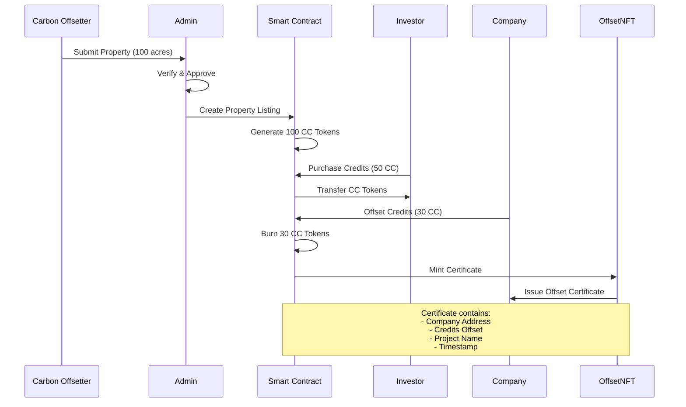

# 🌱 [UniCarbon](https://uni-carbon-www.vercel.app/)

> **The New Age Re-Fi Protocol for Sustainability Projects**

A decentralized platform that tokenizes carbon credits, enabling users or businesses to invest in verified environmental projects and offset their carbon footprint through blockchain technology.

# Tech Stack of Unicarbon

### **Frontend**
- **React 18** + **TypeScript** - Modern UI framework
- **Vite** - Fast build tool and dev server
- **Tailwind CSS** - Utility-first styling
- **Framer Motion** - Smooth animations
- **React Router** - Client-side routing
- **Zustand** - State management

### **Backend**
- **Next.js 15** - Full-stack React framework
- **Hono** - Lightweight web framework
- **Supabase** - Database and authentication
- **Razorpay** - Payment processing

### **Blockchain Infrastructure**
- **Kadena Chainweb** - Multi-chain EVM-compatible blockchain
- **Hardhat** - Ethereum development environment
- **Solidity** - Smart contract language
- **OpenZeppelin** - Secure contract libraries
- **Ethers.js** - Blockchain interaction
- **Chainweb EVM** - Smart contract deployment platform

### **Infrastructure**
- **Turborepo** - Monorepo management
- **Bun** - Fast package manager
- **Vercel** - Deployment platform


### **Kadena's Role in Carbon Credits**
- **Sustainable Infrastructure** - More energy-efficient than traditional blockchains
- **Cost-Effective Transactions** - Enables micro-transactions for carbon credits
- **Regulatory Compliance** - Better suited for environmental regulations

---

## Project Idea 🎀

UniCarbon is a DeFi platform that connects **carbon offsetter** with **companies** seeking to offset their carbon emissions. Here's how it works:

### **For carbon offsetter** 🏞️
- Who own 100+ acres of land or and carbon offsetter property or asset can list your carbon reduction project
- Generate verified carbon credits (e.g., 100 units from 100 acres)
- Get paid for your environmental impact

### **For Companies** 🏢
- Purchase carbon credits to offset your company's emissions
- Meet ESG goals and regulatory requirements
- Receive NFT certificates as proof of carbon offset
- Transparent, blockchain-verified impact tracking

### **For Admins** 👨‍💼
- Verify and approve land owner projects
- Manage the carbon credit marketplace
- Ensure compliance with environmental standards
- Oversee the entire carbon credit lifecycle

**Key Benefits:**
- **Tokenized Carbon Credits** - ERC20 tokens representing verified carbon reductions
- **NFT Certificates** - Immutable proof of carbon offset
- **Transparent Pricing** - Real-time market pricing for carbon credits
- **Verified Projects** - Only government-approved environmental projects
- **Direct Impact** - Connect land owners directly with companies

---

## 🔄 Complete Application Flow

### **Phase 1: Property Listing & Verification** 📋
```
Land Owner → Admin Verification → Property Listing
     ↓              ↓                    ↓
Submit Land    Verify Ownership    Create Property
Documentation  Check Feasibility   Generate Credits
```

### **Phase 2: Investment & Credit Purchase** 💰
```
Investor → Browse Properties → Purchase Credits → Receive Tokens
    ↓            ↓                    ↓              ↓
Register    View Available      Pay via Razorpay   CC Tokens
Account     Carbon Projects     Fiat Payment       in Wallet
```

### **Phase 3: Carbon Offset & Certification** 🏆
```
Company → Burn Credits → Generate NFT → Certificate
    ↓         ↓             ↓            ↓
Offset      Destroy CC    Mint NFT    Proof of
Emissions   Tokens        Certificate Offset
```

---

# 🏗️ Technical Architecture

## **Smart Contract Details**

#### **CarbonCredit.sol** - ERC20 Token
```solidity
// Key Functions:
- mint(address to, uint256 amount)     // Admin mints new credits
- burn(uint256 amount)                // User burns credits
- burnFrom(address account, uint256)  // Burn from another account
```

#### **OffsetNFT.sol** - (ERC-721) Certificate Generation
```solidity
// Key Functions:
- mintCertificate(address to, string uri)  // Mint offset certificate
- _setTokenURI(uint256 tokenId, string)    // Set certificate metadata
```

#### **CarbonOffsetManager.sol** - Main Logic
```solidity
// Key Functions:
- buyCredits(uint256 amount)         // Purchase credits with KDA
- offset(uint256 amount, string)      // Offset credits, get NFT
- projectComplete(uint256 amount)     // Admin funds central wallet
- generateMetadata()                 // Create NFT metadata
```


---


## **Detailed Credit Flow**



# **Deployment Configuration**
- **Network**: Kadena Chainweb Testnet
- **Chain ID**: 20 (EVM Testnet)
- **Gas Token**: KDA (Kadena)
- **Block Explorer**: [Chainweb EVM Explorer](https://chain-20.evm-testnet-blockscout.chainweb.com)
- **RPC Endpoint**: `https://api.testnet.chainweb.com/evm/chain/20`

---

# 🚀 Getting Started

### **Prerequisites**
- Node.js 18+
- Bun package manager

### **Environment Setup**

1. **Clone and Install**:
   ```bash
   git clone https://github.com/your-username/UniCarbon.git
   cd UniCarbon
   bun install
   ```

2. **Configure Environment Variables**:
   ```bash
   # Frontend (.env)
   VITE_SUPABASE_URL=your_supabase_url
   VITE_SUPABASE_ANON_KEY=your_supabase_key
   VITE_RAZORPAY_KEY=your_razorpay_key
   VITE_BACKEND_URL=http://localhost:3001
   
   # Backend (.env.local)
   SUPABASE_URL=your_supabase_url
   SUPABASE_SERVICE_KEY=your_service_key
   RAZORPAY_KEY_ID=your_razorpay_key
   RAZORPAY_KEY_SECRET=your_razorpay_secret
   
   # Hardhat (.env)
   KADENA_PRIVATE_KEY=your_private_key
   KADENA_RPC_URL=https://api.testnet.chainweb.com/evm/chain/20
   ```

3. **Deploy Smart Contracts**:
   ```bash
   cd apps/hardhat
   bun run deploy:testnet
   ```

4. **Start Development Servers**:
   ```bash
   # Terminal 1 - Frontend
   cd apps/www
   bun dev
   
   # Terminal 2 - Backend
   cd apps/api
   bun dev
   
   # Terminal 3 - Hardhat (if needed)
   cd apps/hardhat
   bun run chain
   ```

---


## 👥 Contributors

We're grateful to all the contributors who help make UniCarbon a reality!

### **Contributors**
- **Saidev Dhal** - 19-year-old OSS builder. I love building cool apps. 
- **Rahul Shah** - FullStack Dev.


---

### **Want to Contribute?**
We welcome contributions from developers, designers, and environmental enthusiasts!
